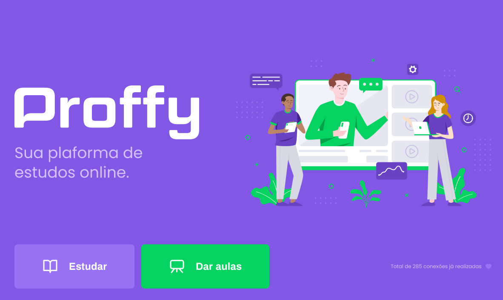
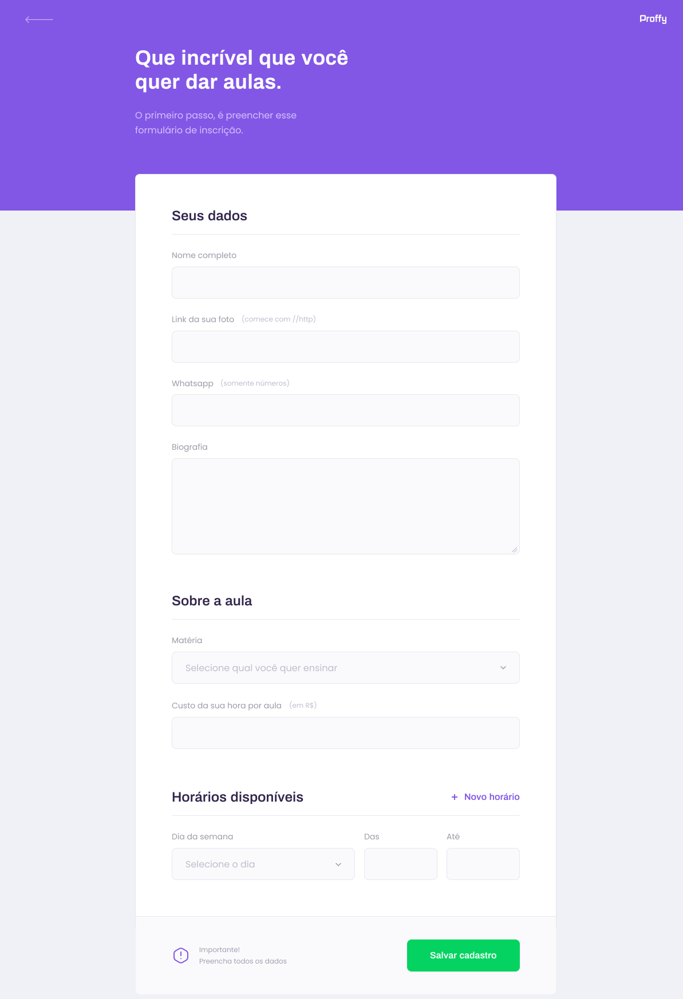

  
  
<strong>Connect</strong> students with teachers

  

## 💡 Project 

Aplication created in NLW 2(Next Level Week) this application is used to connect students with the teachers, and offer the teachers register their classes

This application was created in one week domining front end, back and mobile using JavaScript.

## 💻 Screenshots

<table>
	<tr>
		<th width="50%">
			Web Interface 
		</th>
		<th width="50%">
			Web Register page 
		</th>
	</tr>	
	</tr>
	<tr>
		<td>
			
		</td>
		<td>
			
		</td>
	</tr>
</table>

## 🧾 Features

* Teachers can register their classes and receive proposals from their students.
* Students can contact the teacher and receive their lessons.

## 🛠 Tools 

- [React](https://reactjs.org/)
- [React Native](http://reactnative.dev/)
- [Node.js](https://nodejs.org/en/docs/)

 Projeto desenvolvido durante a NLW#2 da Rocketseat
